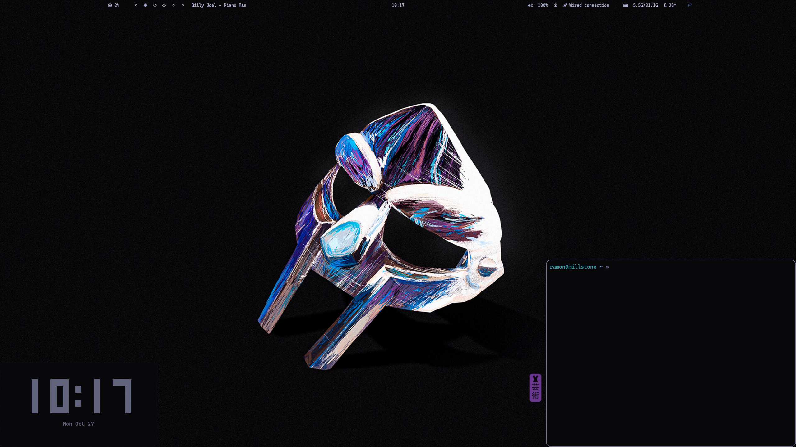

# Hyprland Debian config

- Waybar
- Rofi
- Swaync
- Alacritty
- Zsh
- [Kripton - GTK](https://github.com/EliverLara/Kripton)
- [Papirus - Icons](https://github.com/PapirusDevelopmentTeam/papirus-icon-theme)

Install
- [Nerd font installer](https://www.nerdfonts.com/font-downloads) - CaskaydiaCove Nerd Font
- [Hyprlock](https://github.com/hyprwm/hyprlock)
- [Debian Hyprland](https://github.com/JaKooLit/Debian-Hyprland)
- [Wallpaper](https://github.com/dharmx/walls)
- [Oh my ZSH](https://ohmyz.sh/)

Thanks
- [cebem1nt](https://github.com/cebem1nt/dotfiles) for dotfiles
- [adi1090x](https://github.com/adi1090x/rofi) for rofi themes

