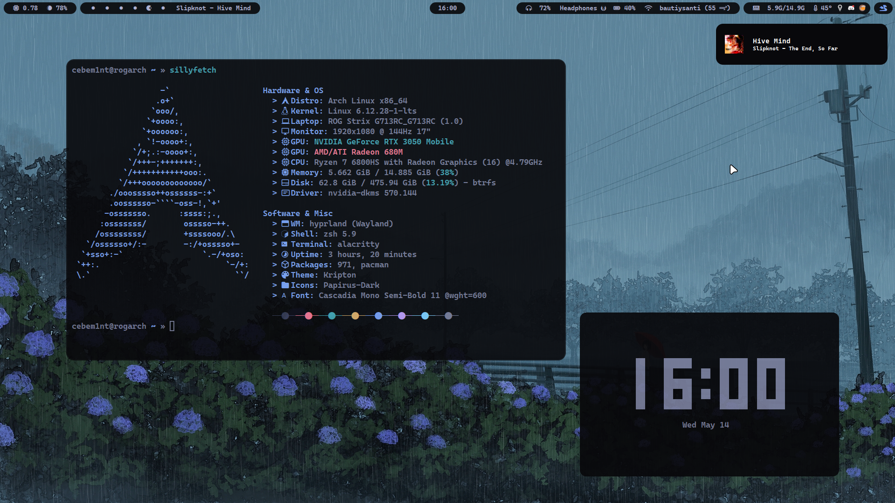
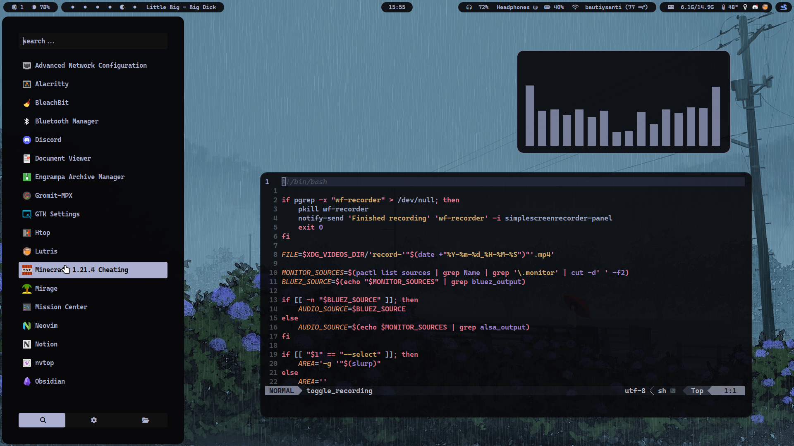
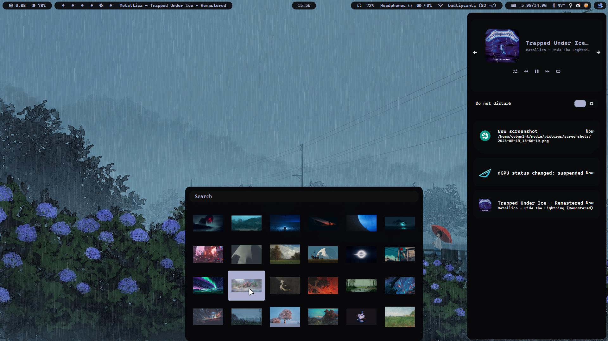
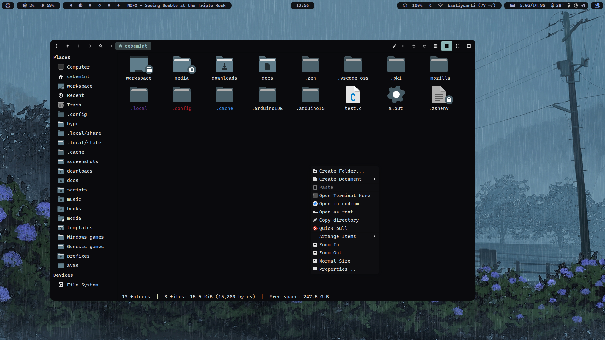
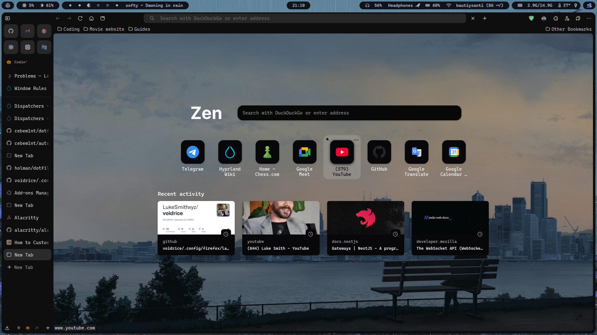
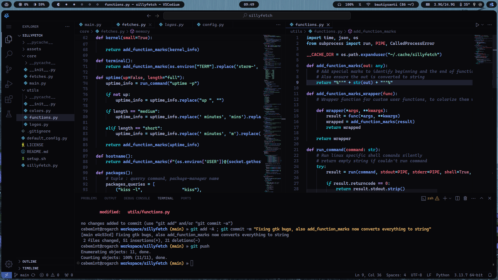

# My dotfiles

### Quick info

- Panel: waybar
- All the menus (except notifications): rofi
- Notifications: swaync (0.11!)
- Terminal: alacritty
- Shell: zsh
- GTK theme: [kripton](https://github.com/EliverLara/Kripton)
- fetch: [mine :)](https://github.com/cebem1nt/sillyfetch)

Big thanks to this [collection of rofi themes](https://github.com/adi1090x/rofi)

## Previews

### Apps

    
📁 Thunar

    

    
🌐 Zen

    

    
💻 vscodium

    

